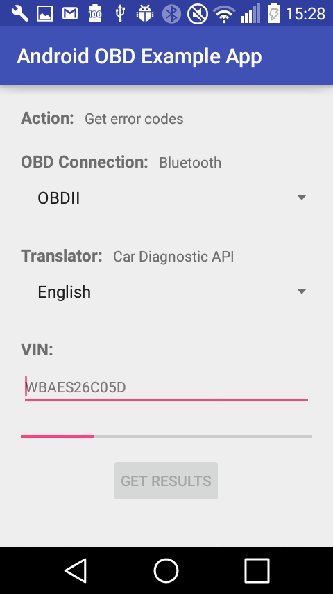
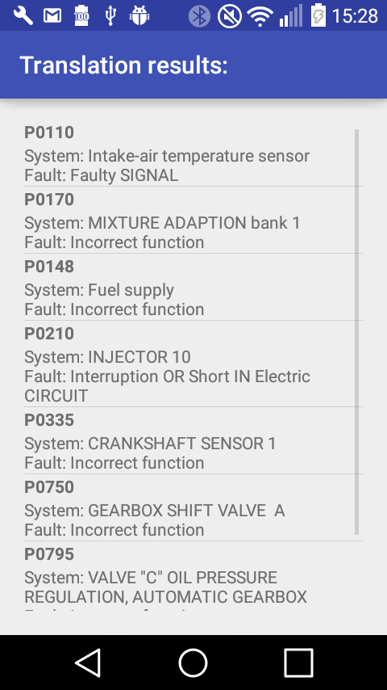

<h1> Android-OBD-Example-App </h1>

<h4> Content </h4>
<ol>
<li> <a href="#overview">Overview</a> </li>
<li> <a href="#features">Features</a> </li>
<li> <a href="#usage">Usage</a> </li>
    <ol>
    <li> <a href="#gettingStarted">Getting started</a> </li>
    <li> <a href="#errorHandling">Error Handling</a> </li>
    </ol>
<li> <a href="#development">Development</a> </li>
    <ol>
    <li> <a href="#hardware">Hardware</a> </li>
    <li> <a href="#dependencies">Dependencies</a> </li>
    <li> <a href="#expansion">Project Expansion</a> </li>
    <li> <a href="#structure">Project Structure</a> </li>
    </ol>
<li> <a href="#feedback">Feedback</a> </li>
</ol>
***

<h2> <a id="overview" href="#overview">1 Overview</a> </h2>
This App can be used as a boilerplate for reading Diagnostic Trouble Codes
(DTCs) from the OBD2 port of a car via Bluetooth. These trouble codes can be
translated with the <a
href="https://github.com/HellaVentures/Car-Diagnostic-API">Car Diagnostic
API</a> by Hella Ventures</li> and their translation will be displayed in the
App.  
   

Note: This App's OBD communication is based on the [Android OBD-II Reader application](https://github.com/pires/android-obd-reader) by pires but was strongly adapted to fit the needed requirements.

<h2> <a id="features" href="#features">2 Features</a> </h2>

Android's Bluetooth features are used to receive the DTCs and the HTTP library Volley for the API connection.
The App provides the following main features:

- OBD2 communication (Bluetooth).
- API communication (Volley).

<h2> <a id="usage" href="#usage">3 Usage</a> </h2>

<h4> <a id="gettingStarted" href="#gettingStarted">3.1 Getting started: </a></h4>

 0. If you want to use our API for translating error codes, follow
    the
    [Getting Started Guide](https://github.com/HellaVentures/Car-Diagnostic-API)
    to get access to
    the
    [Car Diagnostic API](https://console.eu-gb.bluemix.net/catalog/services/car-diagnostic-api/).
    If you just want to read error codes, you can skip this step.
    
 1. Clone this project.
 
 2. Open the ApiHelper.java file with an editor and input your client id and
 client secret, which you got from IBM Bluemix, as value of the constants CLIENT_ID and CLIENT_SECRET.
 These values are necessary for using the API.
 
 3. Build the app and install it on your phone.
 
 4. In your phone's Bluetooth settings, pair your phone with your OBD2 dongle. 
 As a Bluetooth dongle, we can recommend the "BerryKing Autoscan 2016". (For PIN: See your
 Bluetooth dongle's instructions)
   
 5. Start the app.

 6. If Bluetooth is not enabled yet, it asks you to enable it (Press yes).
 
 7. Choose the OBD2 dongle from the paired devices.

 8. Choose your translation language (German or English) in the App.

 9. Input the first 11 digits of your vehicle identification number (VIN).

 10. Press the 'GET RESULTS' button.

 11. The results will be displayed, after they have been received and translated.
 
 <h4> <a id="errorHandling" href="errorHandling">3.2 Error Handling:</a> </h4>
 
 - __OBD Command Failure__: Appears from time to time while using the ISO9141-2 protocol.
    Just try again until it works.
 
 - __Cannot connect to bluetooth device!__: Appears if you have chosen the wrong
 device to connect to or if the Bluetooth dongle is not inserted properly.
   Check the dongle and your chosen device again.

<h2> <a id="development" href="#development">4 Development</a> </h2>

<h4> <a id="hardware" href="#hardware">4.1 Hardware:</a> </h4>
You need the following hardware in combination with this app:

- a vehicle with OBD2 port   or a simulator,
  e.g.
  [Diamex OBD2 Profi Simulator](http://www.diamex.de/dxshop/Diamex-OBD2-Profi-Simulator-alle-Protokolle),
  supporting at least one of the following protocols:  
   
   - ISO9141-2
   
   - KWP2K slow
   
   - KWP2K fast
   
   - CAN 11/500
   
   - CAN 29/500
   
   - CAN 11/250
   
   - CAN 29/250
   

- a Bluetooth dongle, e.g. [BerryKing Autoscan 2016](http://www.berryking.de/)

- a smartphone with Android 4.1 or higher installed

Our test environment included: Diamex OBD2 Profi Simulator, BerryKing Autoscan 2016 and LG-H320 with Android 5.0.1 installed.

<h4> <a id="dependencies" href="#dependencies">4.2 Dependencies:</a> </h4>
The app has the following dependencies:
- **[Android Volley](https://developer.android.com/training/volley/index.html)**: HTTP library for networking in Android apps
- **[obd-java-api](https://github.com/pires/obd-java-api)**: OBD java api for OBD2 communications

<h4> <a id="expansion" href="#expansions">4.3 Project expansion:</a> </h4>
- Click the "Clone or download" button and then "Download ZIP". Unzip the project. In Android Studio do the follwoing steps:  
     **File -> New -> Import Project... -> _Select the unzipped folder_ -> OK**

- Input your client id and client secret (by IBM Bluemix API Connect) as values of the constants CLIENT_ID and CLIENT_SECRET in ApiHelper.java file.

- Adapt the project to your needs.
 

<h4> <a id="structure" href="#structure">4.4 Project structure:</a> </h4>
The project is structured in three main packages: [ui](app/src/main/java/veronika/hella/obdapp/ui), [obd](app/src/main/java/veronika/hella/obdapp/obd) and [api](app/src/main/java/veronika/hella/obdapp/api)

The **ui package** contains the classes for the user interactions:

- **RequestActivity** (+ activity_request.xml): The main/launch activity.  
Includes information about the action to be performed, the connection mode and the translator API.
You can choose one of two translation languages - English (EN) or German (DE) - and you can input your car's VIN or take the default VIN.
With pressing the send button the input values will be read and further processes will be started. 
-> _Takes user input._

- **ResponseActivity** (+ activity_response.xml): The result activity.  
Lists the results of the communcations. 
-> _Displays the translation results._

- **ResultAdapter** (+ result_item.xml): Adapter for the listview of the ResponseActivity. 
-> _Holds the data for the ResponseActivity._

The **obd package** includes all classes needed to communicate with the Bluetooth dongle connected to the OBD port:

- **ObdHelper**: Main OBD communication class.  
Sets up Bluetooth, chooses a device to communicate to and establishes a connection. 
-> _Establishes Bluetooth connection and sends obd commands._

- **MyTroubleCodesCommand**: Adapted version of [TroubleCodesCommand](https://github.com/pires/obd-java-api/blob/master/src/main/java/com/github/pires/obd/commands/control/TroubleCodesCommand.java) 
This subclass of TroubleCodesCommand was adapted to read the CAN response, send by our OBD Bluetooth dongle, correctly. 
-> _Formats the raw data received from the obd to standard error code format._

The **api package** holds the resources used for the API communication:

- **ApiHelper**: Main API communication class.  
Generates URLs and uses them to make a HTTP GET request using the Volley library.  
Uses client id and secret as API's authentication paramters .

<h2> <a id="feedback" href="#feedback">5 Feedback</a> </h2>

If you want to file a bug report or make a feature request for this App, please
use the issues section of this repo.
